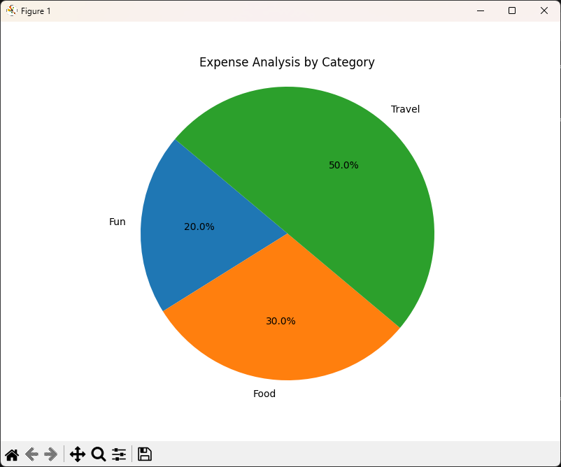

# Software_Engineering_Assigment_2 # Software-Engineering-Assigment2
# Expense Tracking Tool (記帳小工具)

## 📌 專案簡介 (Introduction)
這是一個基於 Python 開發的簡單記帳工具，旨在練習 Git 的分支與協作流程。
本專案分為兩個主要模組：
1. **輸入模組 (Input Module)**：負責記錄消費資訊 (日期、金額、類別、備註)。
2. **視覺化模組 (Visualization Module)**：負責讀取資料並繪製圓餅圖分析消費狀況。

## 👥 成員分工 (Roles)
* **Member A**: 負責開發輸入模組 (`expense_input.py`) 與資料儲存功能。
* **Member B**: 負責開發視覺化模組 (`expense_visual.py`) 與圓餅圖繪製。

## 🛠️ 安裝與設定 (Installation)

### 1. 複製專案 (Clone Repository)
```bash
git clone https://github.com/mimicethan-a11y/Software-Engineering-Assigment2.git
```
### 2. 安裝必要套件 (Install Requirements)
本專案需要安裝 matplotlib 繪圖套件。請執行以下指令：
```bash
pip install -r requirements.txt
```
### 3. 執行步驟 (Usage)
步驟 1：輸入消費資料
執行 Member A 的程式來新增記帳資料：
```bash
python expense_visual.py
```
依照提示輸入 日期、金額、類別 (建議使用英文，如 Food, Transport) 與 備註。
資料會自動儲存至 expenses.csv。

步驟 2：產生圓餅圖
執行 Member B 的程式來查看統計圖表：
```bash
python expense_visual.py
```
程式會讀取 expenses.csv 並顯示依照「類別」統計的圓餅圖。

## 執行成果截圖 (Screenshots)



## 檔案結構 (Project Structure)

├── expenses.csv        # 儲存消費資料 (由程式自動生成)

├── expense_input.py    # 輸入功能主程式

├── expense_visual.py   # 畫圖功能主程式

├── requirements.txt    # 依賴套件清單

└── README.md           # 專案說明文件
